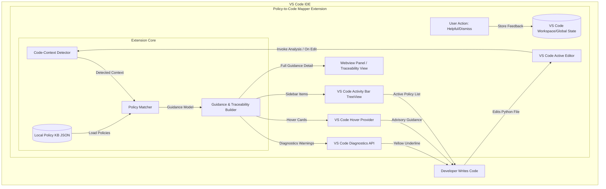

# System Architecture: Policy-to-Code Mapper

## 1. Local-First Architecture Overview
Policy-to-Code Mapper is designed as an extension-first, local IDE assistant. All detection logic, policy mapping, hover guidance rendering, diagnostics, and local state management run entirely within the VS Code Extension Host process.

---

## 2. Component Descriptions

### A. Code-Context Detector (`src/analyzer/`)
- Evaluates active Python file buffers for target logging and output function calls (`print`, `logging.*`, `logger.*`).
- Inspects function parameters and line expressions against sensitive variable/identifier names (`password`, `token`, `api_key`, `email`, etc.).
- Produces structured `DetectedCodeContext` instances detailing line numbers, code snippets, matched identifiers, and function names.

### B. Local Policy Knowledge Base (`src/policies/`)
- Maintained as local JSON (`resources/policies.json`).
- Stores curated organizational policies containing policy IDs, descriptions, risk explanations, mapped sensitive identifiers, suggested actions, safer code examples, and supporting regulatory references (e.g., GDPR Article 32).

### C. Guidance & Traceability Builder (`src/guidance/`)
- Maps detected code contexts to relevant policy records.
- Constructs structured `GuidanceItem` objects including potential considerations, policy citations, explanation, regulatory references, safer code examples, and standard advisory disclaimers.
- Generates full traceability chains connecting `Source Code Evidence → Observed Pattern → Internal Policy → Regulatory Context → Suggested Action`.

### D. User Interface & Presentation Layer (`src/views/` & `src/guidance/`)
- **Diagnostics Provider:** Underlines policy-relevant lines in yellow (warning severity).
- **Hover Provider:** Displays formatted Markdown popups containing full advisory guidance on hover.
- **Activity Bar View:** Hosts an "Active Policy Guidance" tree view listing all findings in the workspace.
- **Traceability / Details View:** Interactive panel showing end-to-end policy traceability and safe code examples.

### E. Local Feedback Store (`src/feedback/`)
- Captures developer feedback (e.g., "Helpful", "Not helpful", "Dismiss") locally using VS Code's `globalState` or `workspaceState`.
- Does not collect personal data or transmit feedback externally.

---

## 3. Data Isolation & Privacy Guarantee
- **Zero External Egress:** Source code and telemetry never leave the local machine.
- **No Cloud Dependencies:** Operates without mandatory API keys, external cloud backends, LLMs, or remote vector stores.
